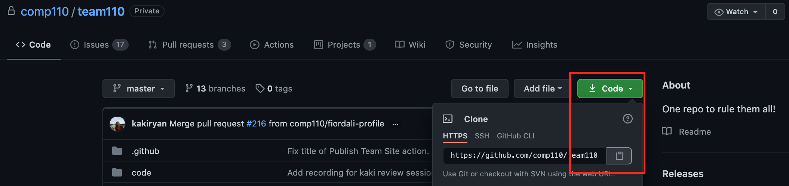
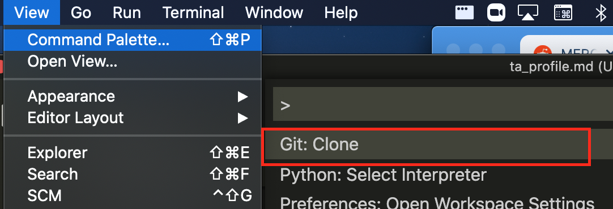
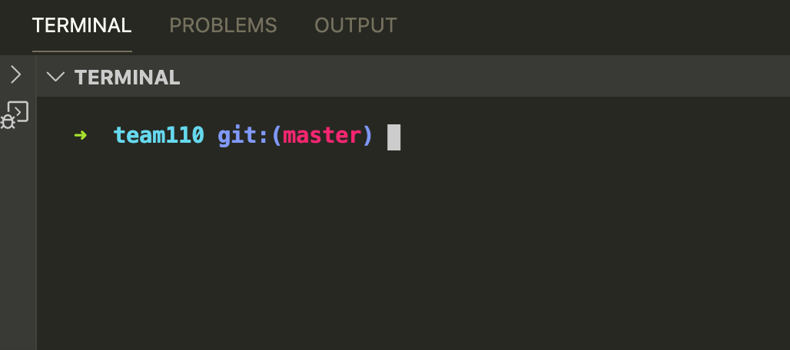

If you have already cloned the team110 repo you can jump to [this step](/course-site-setup#Install-Packages).

## Clone the team110 Repo
- Go to <https://github.com/comp110/team110> and clone the repo by pressing the green code button.
   
  > If you can't open this link, you have not been added to the team org on Github. Send your github username to Kaki!
- Open the `Team 110.code-workspace` file in VSCODE as a Workspace (don't just open the top-level directory)
   
- Make sure you're in the `team110` folder in your terminal and the master branch.
   

## Install Packages
Note: You may have done this step before, but there are often new dependencies being added, so make sure to run the command again.
- Update pip by running: `python -m pip install -U pip`.
- Make sure your terminal is in the right directory. If you type `pwd` in the terminal it should print `/Some/Path/.../team110/code`. If you do not see this, trash the terminal and create a new one. When you create a new one it should prompt you for the desired working directory -- select the `code` option.
- Install required PyPI packages in `requirements.txt` with the following command: `python -m pip install -r requirements.txt`. 

## Install Pandoc
In order to run the dev server, pandoc is needed and can be downloaded [here](https://pandoc.org/installing.html). Follow the instructions to download. You may need to restart vscode in order to run the dev server.

## Run the Development Script
- Make sure your terminal is in the `site` directory. If you type `pwd` in the terminal it should print `/Some/Path/.../team110/site`. If you do not see this, trash the terminal and create a new one. When you create a new one it should prompt you for the desired working directory -- select the `site` option.
- In your terminal run: `python -m dev`. If the script runs without any problems you should see "* Running on <_a-server_>". Command or Control click on the server to open the site in your browser. 
- To view any changes you are making, navigate to the file you have changed and reload the page if you do not see your updates. 

