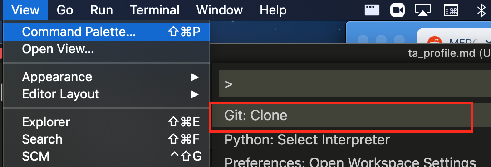

These instructions will walk you through setting up a profile visible on the 110 site!

## Setup

Only complete the following steps if you haven't yet cloned the Team110 Repo.

1. Go to <https://github.com/comp110/team110> and clone the repo by pressing the green code button.
   
1. Open the `Team 110.code-workspace` file in VSCODE as a Workspace (don't just open the top-level directory)
   
1. Make sure you're in the `team110` folder in your terminal and the master branch.
   
1. Update pip by running: `python -m pip install -U pip`.
1. Install required PyPI packages in `requirements.txt` with the following command: `python -m pip install -r requirements.txt`. Before you run this command, make sure your terminal is in the right directory. If you type `pwd` in the terminal it should print `/Some/Path/.../team110/code`. If you do not see this, trash the terminal and create a new one. When you create a new one it should prompt you for the desired working directory -- select the `code` option.

## Creating a Profile

- Make sure you're on the master branch (`git checkout master`) and run the command `git pull origin master` to get the latest updates.
- Checkout a new `git` branch. In your terminal run the following command:
  `git checkout -b ONYEN-profile`
- In the `site/static/profile-photos/` directory insert the photo of yourself you want on your profile. Resize this image to be no bigger than 300x300 and name it `ONYEN`.png/jpg
- In the `site/resources/profiles` directory create a new markdown file named `ONYEN.md`. There should be some template profiles in this directory that you should base yours off of. Feel free to just paste the contents of someone else's profile into yours and fill in the relevant information. You'll want to make sure the relative path to your profile picture is correct. Note: Make sure the file extension of your photo in the `static` directory and the extension in this path match -- it is case sensitive! Doesn't matter if you have PNG or png, just be consistent.

## Creating a Pull Request

1. If you haven't been committing progress on your profile to the branch you setup for it... commit it!
   To do this, first add the files you've changed to the staging area:
   `git add <../site/static/profile-photos/ONYEN.png> <../site/students/profiles/ONYEN.md> <../site/students/resources/team.md>` or you could simply run `git add .` to add every single change file at once.
   Then commit your changes:
   `git commit -m "your_name Profile Page."`
1. Push your work to your training branch on the staff repo (`git push origin [your-branch-name]`). Check your branch with `git branch`.
1. Open GitHub Pull Requests on the `team110` repo: https://github.com/comp110/team110/pulls
1. You might/should see a yellow notification box: "Your recently pushed branches...". If so select "Compare & Pull Request". If not, select "New Pull Request", and in the Compare branch drop-down select your branch.
1. Scroll through the differences and confirm your latest changes were successfully pushed. If you don't see them, check that you committed everything you expected and pushed to your branch. Select "Create Pull Request".
1. In the description box, briefly describe your branch -- "<Name> Profile Page" is just fine.
1. On the right-hand sidebar, select Kaki or Kris as a reviewer.
1. Create pull request!

From here, a brief pass (and potentially some some revisions) will be taken by the reviewer and then merged in.
