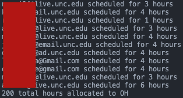
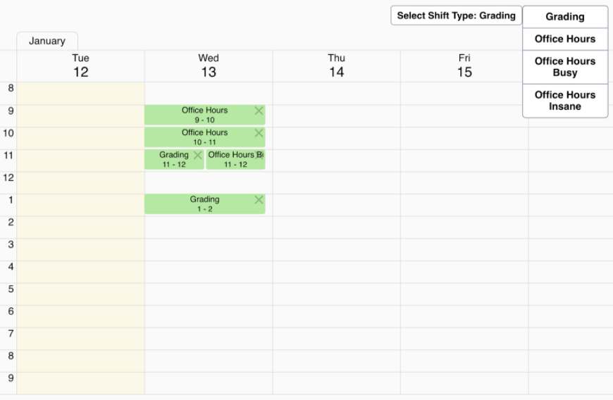
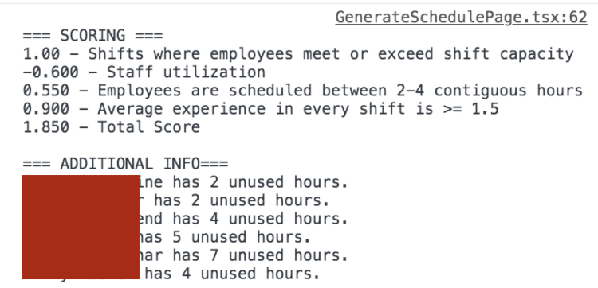
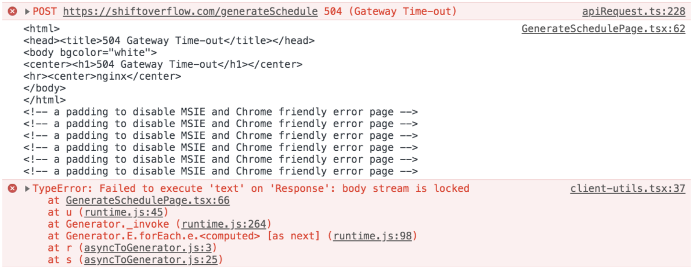

## Key Objectives

- Setup
- Pre-Semester Preparation
- Generating a Schedule

## Setup

To use ShiftOverflow (both for preparing for the semester and for generating weekly schedules), you will need access to the AWS server and MySQL database. Someone who currently has access can get your SSH key set up to be recognized.

Adding ShiftOverflow to your ssh config is helpful since it’s frequently accessed. For reference, here’s mine (in my `~/.ssh/config`) which lets me use the command `ssh so` in order to connect to the server or work with the database:

This is really all you need, though setting up access to MySQL through MySQLWorkbench is helpful when performing manual queries, and the `LocalForward` piece in the screenshot above is important for that.

To access the database outside of MySQLWorkbench, you must be ssh’ed into the server. From there, type in `sodb` which is an alias for the specific command you need to enter the database. This will lead to a prompt for a password, at which point you should type in `shiftoverflow` + press enter (note: you will not be able to see what you are typing). At this stage, you are in MySQL.

---

## Pre-Semester Preparation

### Getting New Members On Board

At the start of all or most semesters, new TAs go through orientation. At orientation, you’ll want them to individually sign up for ShiftOverflow. Here’s a tutorial video for them to watch on how to sign up & navigate ShiftOverflow: [ShiftOverflow intro video](https://youtu.be/xUsdSnAreKA)

The following paragraph is a potential message template you can use to send to all new members to get them started and familiar with ShiftOverflow:

> Hello and welcome to the team! For scheduling UTA office hours each week we use a website called ShiftOverflow. That’s where you can indicate when you’re available to work and also see your schedule each week. [Here’s a video tutorial](https://youtu.be/xUsdSnAreKA) of how to sign up and how to use ShiftOverflow so please go through the signup steps and fill in your availability for next week’s setup days. For signing up, the invite code is **cpu_hat**. Let us know in the _#newmembers_ Slack channel if you run into any issues or have any questions doing this!

You must provide an invite code to them before they can sign up in order for them to join the correct team. To find the current invite code, within MySQL run the query:

`SELECT inviteCode FROM shiftoverflow.team where name="COMP 110";`

Remove the `where` clause and change `inviteCode` to `*` if wanting to see info about every team.

**Important**: The email they use to sign up must match the email associated with them in Airtable (and if not, this will need to be corrected in order for allocations to be automated).

### Log In Issues

Occasionally, people have experienced being unable to login to ShiftOverflow or seeing a completely blank page upon navigating to the site. This usually happens when the server runs out of space so clearing old logs or unused items on the server can help stop this (more detailed steps for going about this are described in the [ShiftOverflow Development guide](/shiftoverflow#Troubleshooting)).

### Airtable

To get access to Airtable, talk to Kris or Kaki. Specifically, you will want access to the Appointments table. This way, you can find the View for the current semester (ie SP21) to know who should be on which teams and current office hours allocations.

### Checking and Changing People’s Teams and Admin Status

A lot of the pre-semester preparation involves making sure people are on the right teams in ShiftOverflow with the right credentials. This can be done any time before the first round of schedule generation. As mentioned above, referencing the Airtable is helpful in knowing who should be where.

For former members, it is not strictly necessary to move them out of the COMP 110 team in MySQL but it can be helpful to reduce clutter in output and on ShiftOverflow’s `Manage Members` admin page. This (combined with changing the invite code periodically) also prevents previous members from adding availability, getting scheduled, or adding themselves to schedules when they are no longer TAing. If you move them off of the COMP 110 team, the `Retirement Home` team is a good place to move them to.

In the [team repo](https://github.com/comp110/team110) we have jupyter notebooks you can use to change someone's team or make a new person admin. You can find these in the `team110/code/admin/shiftoverflow` directory. Alternatively, you can perform those actions manually in the database by completing the following steps:

1. Find the member's personId using: `SELECT id FROM shiftoverflow.person where email="<email-address>";` where the value in quotes is that member's email address. You can also query by other information like `firstName` or `lastName`.

   > example: `SELECT id FROM shiftoverflow.person where email="test@gmail.com`

2. Use the output `personId` from the previous step to find that person's current team memberships: `select teamId from membership where personId=<personId>;`

> example: `select teamId from membership where personId=26`

3. The numeric output(s) from the query above represent the `teamId`s of the teams the person is on. Find out which team that id refers to and what other teams exist in the `team` table: `SELECT * FROM shiftoverflow.team;`

4. Replace the current team id to the desired team id (in this example **5** is the new id and **1** is the old team id): `UPDATE shiftoverflow.membership SET teamId=<newTeamId> WHERE personId=<personId> and teamId=<oldTeamId>;`

> example: `UPDATE shiftoverflow.membership SET teamId=5 WHERE personId=26 and teamId=1;`

Before you can generate weekly schedules you’ll also need to make yourself an admin on ShiftOverflow which can be done using one of the jupyter notebooks mentioned above or manually via MySQL: `update membership set isAdmin=1 where personId=<yourPersonId> and teamId=1;`

### Updating Shift Lead Credentials

Each semester, people who have gained enough experience can now be designated shift lead. This usually happens for people who have TA'd for >= 1 semester TAing. It is good to keep this attribute up to date so each shift can maintain a shift lead. You can give someone the shift lead attribute through the web UI or through MySQL directly.

To change this credential via MySQL, use this query replacing `<personId>` with the actual `personId` of the person you are making a shift lead (the 1 is the id of the 110 shift lead attribute): `INSERT INTO shiftoverflow.person_attribute (attributeId, personId) VALUES (1, <personId>);`

To change this credential via the web UI, go to the admin page on ShiftOverflow by clicking the **Admin Page** button on the bottom left of the home screen. If you do not see this button, make sure you went through the step to make yourself admin. Once on the Admin Page, select **Manage Members** (and if you are an admin on multiple teams, select the team you are working on). Then, scroll to the person you want to make a shift lead. This will show you their info, with the last piece being **Attributes**. There, select the **plus sign in a dashed circle** which will show you a dropdown of possible attributes, from which you want to select **Shift Lead**.

### Making Sure the Allocation Update Script Uses the Current Semester Data and Can Run

The script to update allocations can be found in the team repo under `team110/code/admin/shiftoverflow/allocations`. In order for the script (`update_allocations.js`) to work, you will need to get the `credentials.json` file from someone who currently has it (likely whoever is currently scheduling) and put it in the same directory, at the same level, as the script. The script pulls from Airtable for up-to-date allocations. **Line 25** specifies the View and should reflect the current term (ex. view: "FA20"). This script is used before schedule generation each week to ensure correct allocations are used, or whenever a change is made to allocations. More details on how to run the script are included in the upcoming 'Update Allocations' section.

### Setting Recurring Reminders for Availability Updates

To set recurring Slack reminders for people to submit updates to their availability, in a new Slack message type:

> /remind #announcements to please get updates to your availability for next week's office hours in on shiftoverflow.com by tonight at 5PM! every Wednesday at 12:00PM

This will set the recurring reminder to send every Wednesday at noon in the #announcements channel from Slackbot. It is done on Wednesdays since usually the goal is to generate a schedule by Thursday night, which is a nice balance between giving people enough time to account for changes in availability and enough advance notice for Sunday office hours.

---

## Generating a Schedule

Schedule generation usually happens weekly on Thursdays. It is important to be aware that any schedules you generate are automatically published, and each time you generate a schedule, a notification with the schedule score and output is sent automatically to the `#shiftoverflow-actions` channel in Slack. The automatic publishing of every schedule generated can cause confusion if you create a schedule & then later re-generate that same schedule, as people may mistake a draft version of the schedule for the final version. This can be mitigated by completing the schedule generation in one sitting or doing it at a time when people are unlikely to be checking ShiftOverflow (such as when office hours are closed).

The following steps walk through the process of generating a schedule.

### Update Allocations

1. In order to update allocations, you first need to connect to the MySQL database, so `ssh` into the server in a separate terminal window, since the connection only needs to be open in the background and we do not need to do anything from within the server.

1. To run the allocation update script, in a terminal within the `team110/code/admin/shiftoverflow/allocations` directory run `node update_allocations.js` and you will see the output in the same console, including any errors as well as how many hours were allocated per person and the combined total number of hours allocated to office hours.

1. If you see output about issues regarding there not being a match for a person between MySQL and Airtable, it is likely an issue with them having used different emails for team communication and ShiftOverflow, so using one email address per person will reconcile such issues.

For all people whose emails were able to match between Airtable and MySQL, the script updates their office hours allocation in MySQL based on the corresponding current value in Airtable. Comparing the total number of hours allocated that gets reported at the end of the script's execution (as well as reported individual allocations if necessary) with the values in Airtable is helpful for verifying that all updates occurred as expected. Example output is shown below:

### Check or Update Shift Types

In the Admin Page, select **Manage Shift Types** (and select the team you are generating a schedule for if you are an admin on multiple teams). Here you will see all Shift Types for that team. An example is below:

1. The **110 OH** is an editable field & serves as the name of the shift that will appear on the schedule. Other key elements are the **min** (3) and **max** (10) people. When in-person office hours are held, the max is often constrained based on how many physical desks are available in the office hours room. The other important piece is the **shift lead constraint** which indicates you want the algorithm to try to have every shift of this type to have a lead.

1. The plus button at the top right will create a duplicate of that shift type, and the adjacent x button will delete that shift type.

1. The **Add shift type** button allows you to create a new shift type.

Shift types are used when building the desired hours and shifts for the schedule you are about to generate.

### Add Shifts

In the Admin Page, select **Manage Shifts**. If you’re admin on multiple teams, you’ll need to select the team you’re making a schedule for. Also on this page you will see a calendar and above it a **Select Shift Type** button prefilled with a default shift type that can be changed by clicking & choosing from the dropdown of all available shift types. The type you select is what will be scheduled. It is possible to mix and match shift types with some from one type and shifts of another type as well.

1. In the calendar on this page, the numbers on the left refer to hours and the dates at the top days. To add a shift to a timeslot, click in the box corresponding to that timeslot. You may also create consecutive shifts by clicking in a timeslot to start the range you want and dragging through the desired slots.

1. To delete a shift, click the **x** on the right side of the shift’s box. It is also possible to schedule multiple shifts for the same hour. To do that, once a shift is allocated to that timeslot, click the white background portion to the right of the already scheduled shift. Simultaneous shifts do not need to be the same type. It’s also worth knowing that if you do this, a person can be scheduled for multiple simultaneous shifts.

1. Note that sometimes there is a delay between when you click or drag and when the shifts appear. This is sometimes resolved by waiting a few seconds or by clicking to make another shift somewhere else to force an update (then deleting it if you don't actually want that shift).

1. Also note that this calendar goes from 8am to 10pm but the home page schedule view only shows 10am to 8pm, so adding shifts outside this range may schedule people in shifts that won’t appear.

Additionally, when you add shifts on the **Manage Shifts** page, they will appear as shifts with 0 people in the full schedule view on the homepage. Similarly, deleting shifts in the **Manage Shifts** page will cause them to be removed from the schedule view on the homepage as well so be careful not to delete shifts once the schedule has been released.

### Select Dates for Generation

1. In the Admin Page head to the **Generate Schedule** tab and if necessary select which team you’re scheduling. Then, select which shift types you want included. By default, all existing shift types are selected but only the ones you selected and added in the Manage Shifts tab will be used.

1. Next, select the **Choose dates** button below all the listed shift types to open a date picker popup and select the dates you are scheduling for. After, select **Done**.

1. ShiftOverflow will report under the **Choose dates** button any members of the team who have less availability than 2x their allocation (which is the minimum number of hours we ask members to mark available).

### Schedule Generation

Before generating the schedule, open the console in the browser as this is where output is reported. Then, when you select **Generate Schedule** check the score in the console. The key piece to look at is Staff utilization, which should always be 1, otherwise there are people who aren’t scheduled the full amount they should be. As a related point, check for unused hours below the scoring section in the additional info section of the output. This tells you each person who is not scheduled their full amount and how many hours short they are.

Example generation output (though not entirely realistic with the negative utilization, as that is the result of no one having any availability) is below:

It’s often good to generate the schedule a few times before settling on a final version to know what you’re working with. You can regenerate the schedule as many times as you want by re-clicking the **Generate Schedule** button. As a warning, regenerating the schedule many times in a row may cause a timeout / an error about the body having already been consumed / being locked or something similar (an example is below). In that case, pausing and giving it a minute to bounce back helps, and eventually things start working again. Sometimes, after the request has been in progress for a while or has timed out, errors may appear in the console or no output may appear, but the schedule score information may still be posted in Slack.

Once you feel good enough about the Slack/console output, check the schedule on the home page in full calendar mode. You’ll have to click through each shift one by one in order to see who is scheduled in each shift which is good to do to make sure a) each shift has a lead or b) that, during the beginning of the semester, no shift is entirely staffed with new members.

You also have the ability to download a CSV of the full schedule to see every person scheduled in every shift (which could be used as another method for ensuring each shift has a lead) along with a CSV of everyone's availability. The CSV of availability is nice way to check:

1. when people are scheduled less than their full allocation
1. when the algorithm missed an opportunity to schedule them
1. when they do not have enough availability in the available range of hours

If people do not have enough availability and are not scheduled their full allocation, message them and tell them to add themself to however many hours they are short by before that schedule period begins (before the first office hours of that schedule). All instances of someone adding (or dropping or swapping) themself to a shift are logged in the database and send automatic alerts with the details of the action to the `#shiftoverflow-actions` Slack channel, so you can confirm that they do add themself, and follow up later if they do not.

If the console shows the schedule successfully generated but each shift in calendar view shows 0 people working, add yourself to a shift (you can remove yourself later) and that should cause everything to update. The schedule should fill in at that point.
